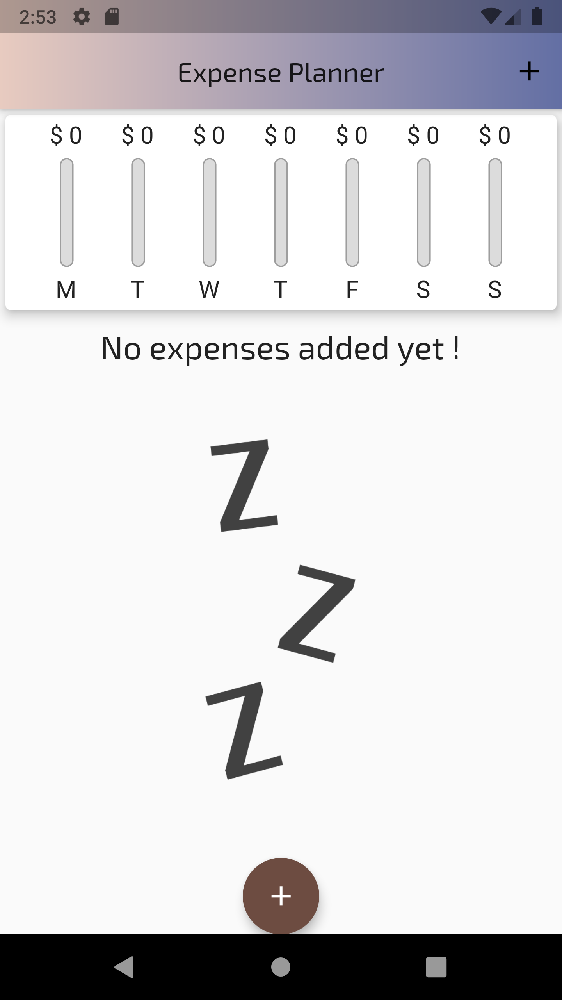
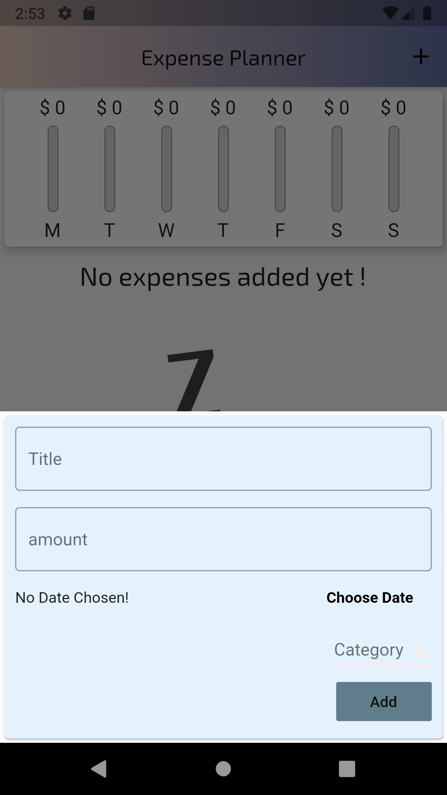
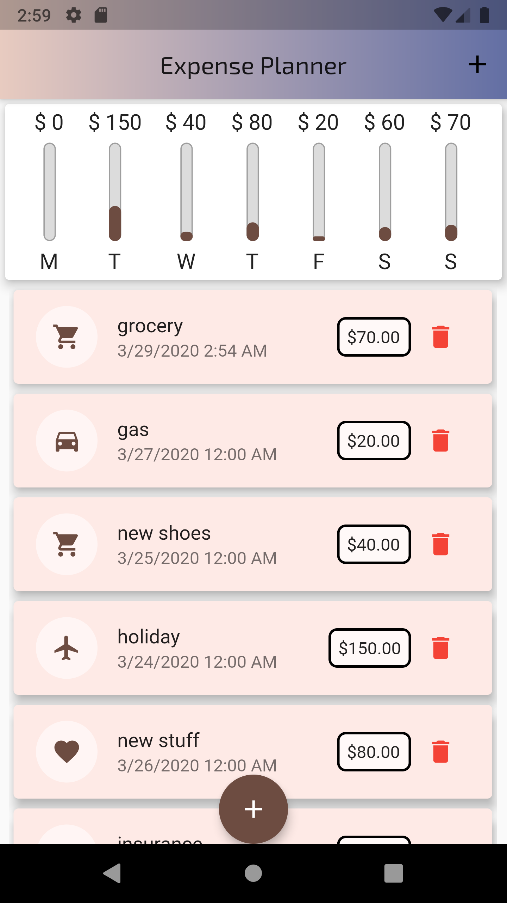
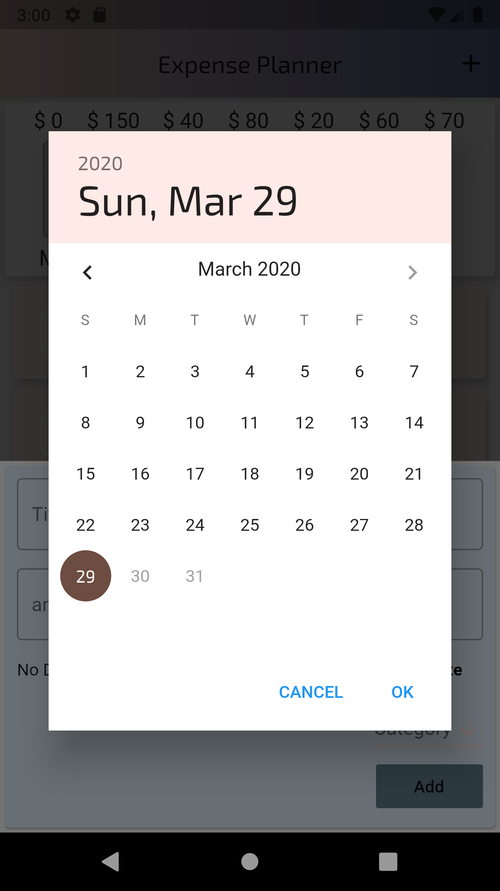
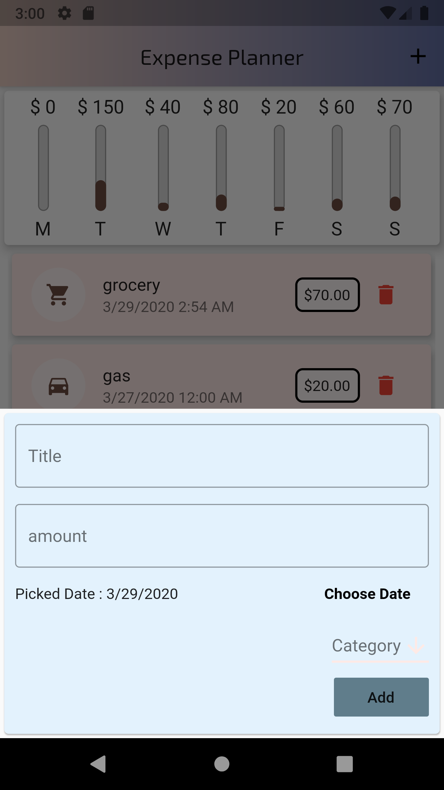
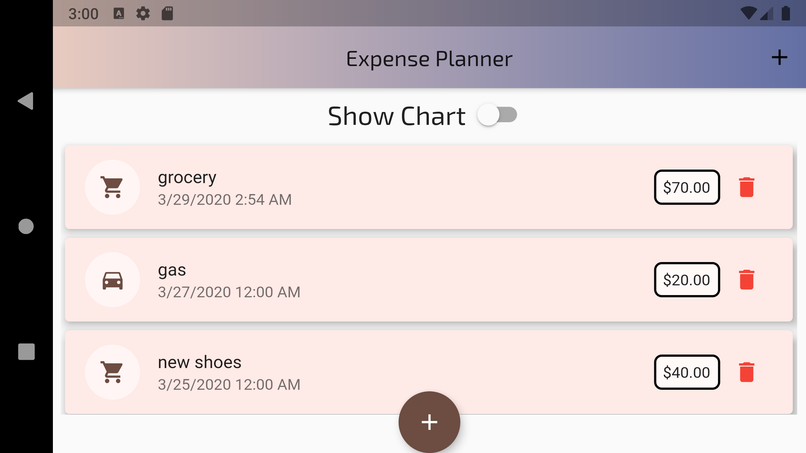
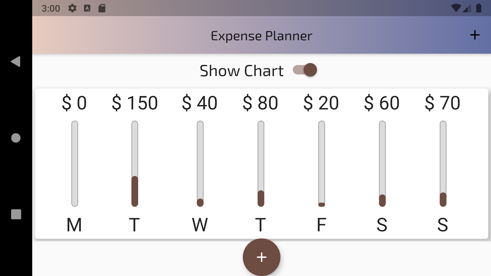

# Expenses Planner

Expenses planner is a manager for your personal finances. It can help you keep track of your expenses and income, so you can spend less and save more. 

## Screenshots
  
  
 
### Landscape
  

